# OpenRide

<p align="center">
  
</p>

OpenRide is a free, independent workout app for the Peloton Bike (Gen 2) and Bike+. It replaces the screen you normally see when you turn on the bike with a similar-feeling experience — live stats while you ride, a library of free cycling videos, workout mini-games, and a history of all your past rides — without needing a Peloton subscription.

It's installed using a free tool called [OpenPelo](https://github.com/doudar/Openpelo), which lets you add apps to the bike's tablet. This doesn't require rooting the device or unlocking anything permanently.

<p align="center">
  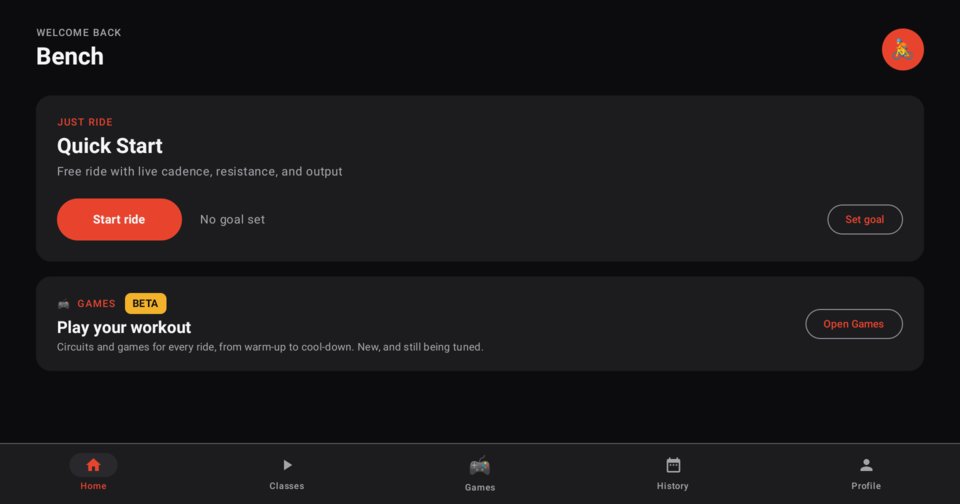
  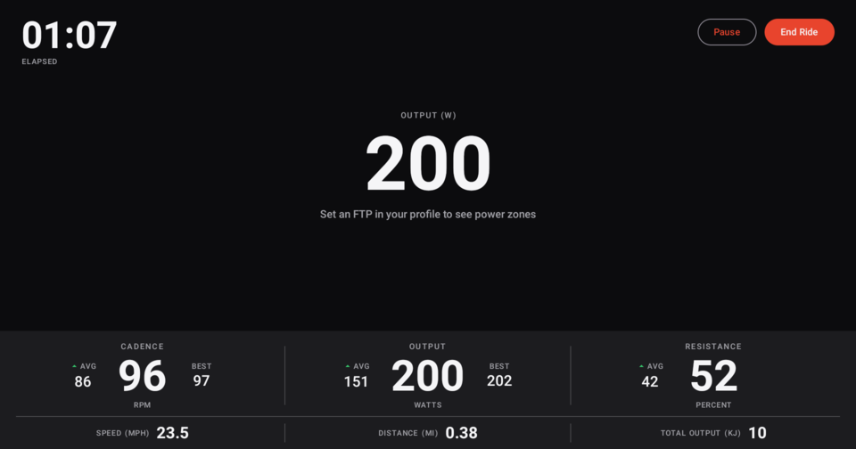
  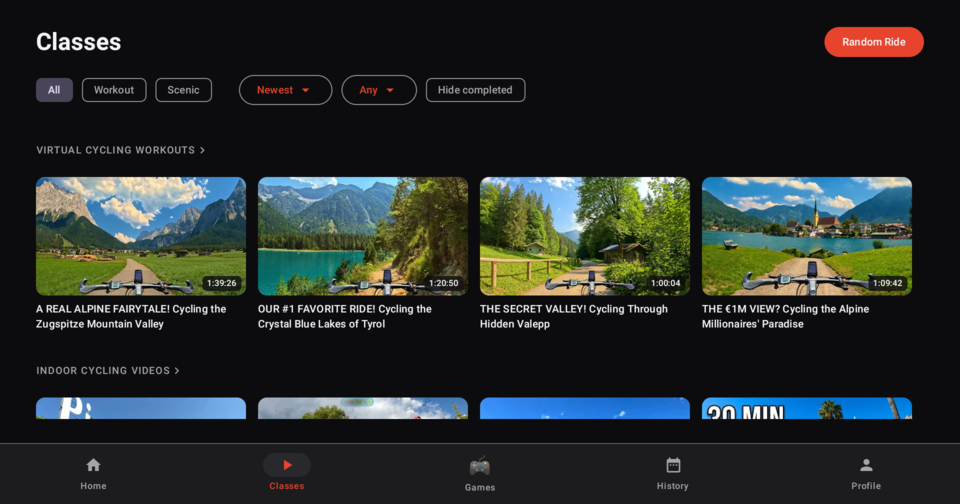
</p>

## What it does

- **Live stats while you ride** — cadence, resistance, power, and speed, pulled straight from the bike itself, with no subscription required
- **A profile for everyone in the house** — each rider gets their own name, picture, and workout history
- **A library of free classes** — a constantly-updating selection of cycling videos pulled in automatically, so there's always something new to ride to
- **Mini-games (BETA)** — pedal-powered games that turn interval training into play, plus 20-, 30- and 45-minute game circuits. [Details below](#mini-games-beta)
- **Ride history and personal bests** — a calendar of every past ride, plus your all-time best output, cadence, and duration
- **Export your ride data** — download any ride as a file (FIT, TCX, or CSV) to keep or use elsewhere, so your data is always yours
- **Heart-rate strap and Bluetooth headphone support** — pair a heart-rate monitor, and headphone audio just works once paired

<p align="center">
  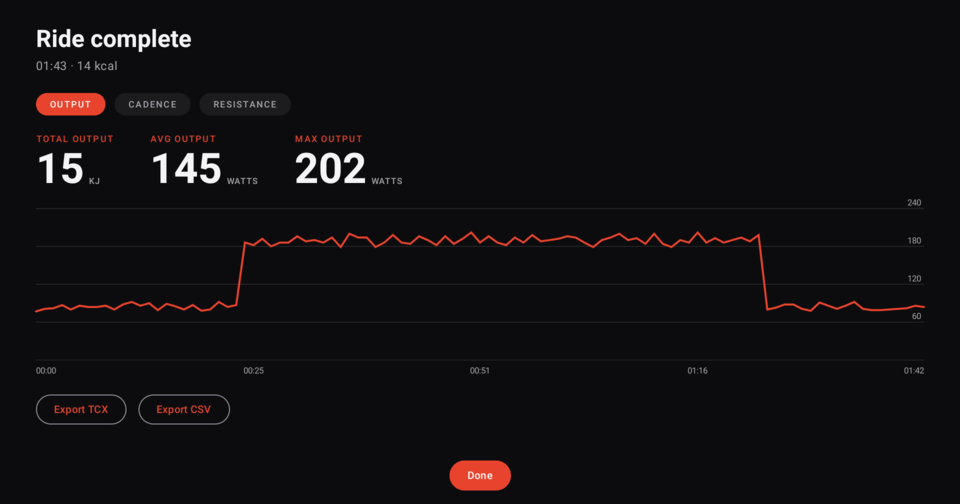
  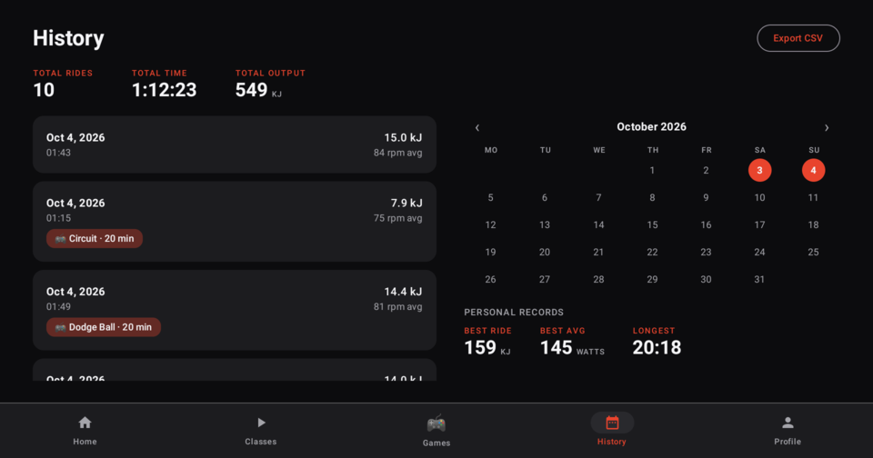
  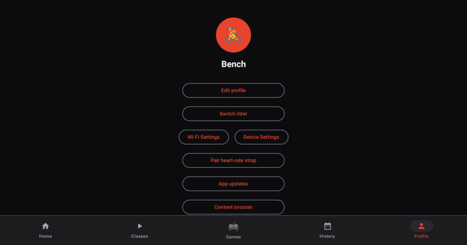
</p>

## Mini-games (BETA)

> [!IMPORTANT]
> **The mini-games are in BETA.** They are new, they have only had a little time on a real bike, and difficulty and scoring are still being tuned, so expect rough edges. **Feedback, ideas and pull requests are very welcome** — they are how we make this better. See [Help us make it better](#help-us-make-it-better) below.

Workouts that play like games. Open the **Games** tab (or the *Games BETA* card on Home), pick a game or a circuit, and ride. The bike's cadence, resistance and power are the controller: pedal to move, turn the resistance knob to score more, and the game keeps track of the rest. Every session is saved to your history like any other ride.

<p align="center">
  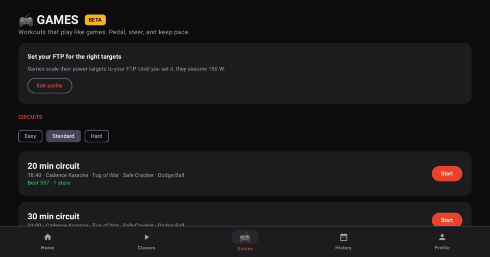
  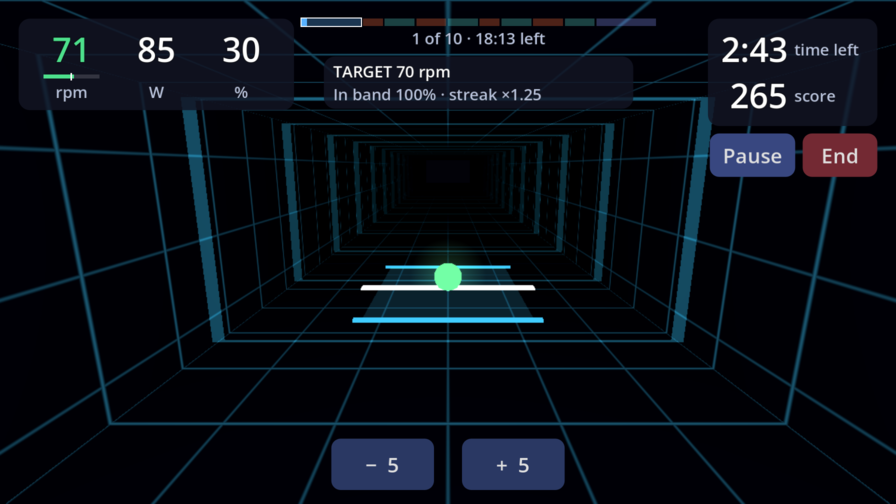
</p>

### The games

<p align="center">
  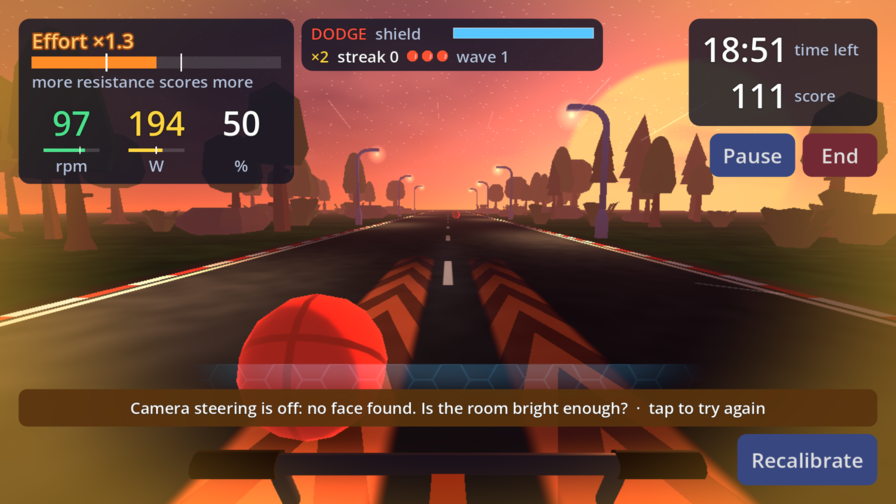
  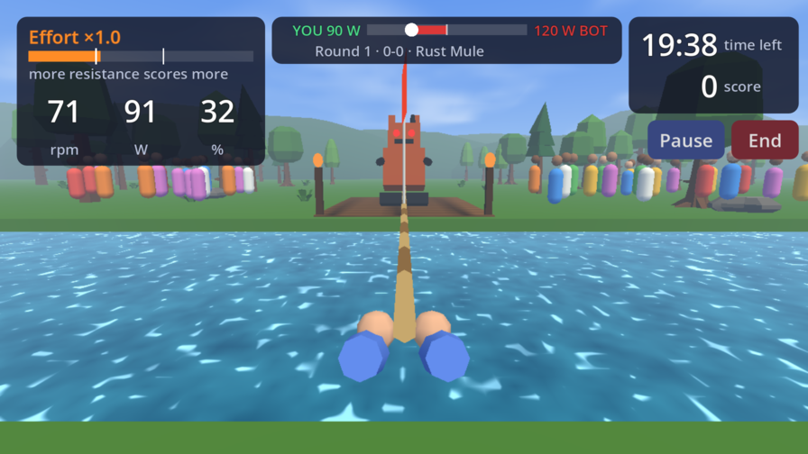
</p>
<p align="center">
  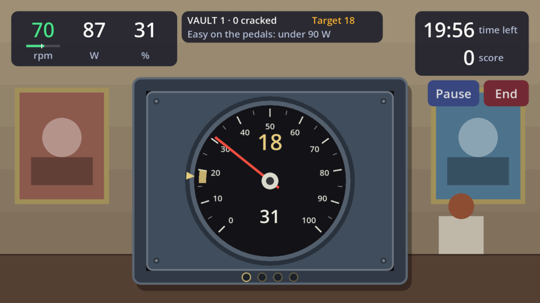
  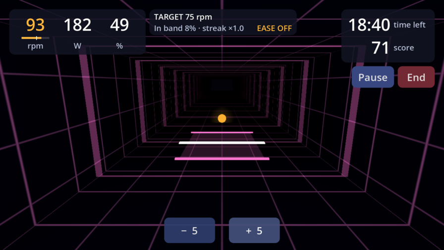
</p>

| Game | How it plays |
| --- | --- |
| **Dodge Ball** | A first-person ride down a sunset road. **Lean your head** to dodge balls coming at you — or switch to *Catch* mode and lean into the gold ones. Keep your cadence above the floor so your points count. Uses the camera. |
| **Tug of War** | A rope across a river and a robot on the other bank. Your watts against its watts: out-pedal the bot to win the round, and brace through its surges. Best-of-rounds matches. |
| **Safe Cracker** | A vault dial that you turn with the **resistance knob**. Hit each number and hold it to crack the safe, then move to the next — but keep your power under the cap or the alarm trips. |
| **Cadence Karaoke** | A neon tunnel with a target rpm set to the beat. Pedal at the target to keep the ball in the box; the **−** and **+** buttons set the pace you're comfortable with. |

Each game can be played on its own as a **Just Ride** — for a set time, open-ended, or (for Dodge Ball, Tug of War and Safe Cracker) a set number of rounds — at Easy, Standard or Hard.

### Circuits

A circuit strings the games into a structured interval workout — warm-up, work and recovery segments, each with its own game — in **20, 30 or 45 minutes**. A progress strip shows where you are, and the summary at the end lists every game and its result.

### Good to know

- **Resistance scores more.** In the effort games (Dodge Ball and Tug of War), points get a multiplier from 1.0× at light resistance (30% or less) up to 1.5× at 60% and above — but only while you're pedaling at 60 rpm or more, so grinding at a standstill doesn't count.
- **Targets follow your FTP.** Games scale their power targets to your FTP. Set it in **Profile → Edit profile**; until you do, they assume 150 W.
- **The camera is optional, and private.** Only Dodge Ball needs it (and Tug of War's optional *brace lean*), to find where your head is. It looks for a head position, and nothing is recorded or saved. If you don't allow the camera, circuits swap Dodge Ball for a camera-free game. A well-lit room helps.
- **Music and sound effects are generated on the device.** Game music turns itself off while you're playing your own music (you can set it to always on or off, and set volumes, at the bottom of the Games tab).
- **Stars and personal bests.** Each game awards up to three stars and remembers your best.

### Help us make it better

The games are the newest part of OpenRide, and the part that most needs real riders. The difficulty numbers are educated guesses, there are rough edges nobody has hit yet, and there are plenty of ideas still to try. If you ride them, **please tell us what you think**:

- **Feedback and bugs** — [open an issue](https://github.com/digitalducktape/openride/issues/new). Was a game too hard or too easy? Did the camera lose you? Did the music or a screen feel off? Tell us your bike (Gen 2 or Bike+) and what happened.
- **Ideas** — a new game, a new circuit, a better way to score? [Open an issue](https://github.com/digitalducktape/openride/issues/new) and describe it. The [tuning and follow-up list](https://github.com/digitalducktape/openride/issues/49) shows what's already planned, and a long-form Kart Race is [on the list too](https://github.com/digitalducktape/openride/issues/43).
- **Pull requests** — very welcome, from a typo to a whole new game. [docs/GAMES.md](docs/GAMES.md) explains how the games are built and how to add one (they're a [Godot](https://godotengine.org/) project). Small, focused PRs are easiest to review, and it's worth opening an issue first for anything big.

Please keep any new game original: mechanics can be inspired by classic ideas, but names, art, audio and code should be your own or under a permissive licence.

## Getting the app

OpenRide isn't available in an app store — you install it onto the bike's tablet yourself, either by downloading a ready-built APK from GitHub or by building it from this repo. This does take a little technical setup, but the steps below walk through everything.

### What you'll need

- A Peloton Bike (Gen 2) or Bike+, with [OpenPelo](https://github.com/doudar/Openpelo) already set up on it. OpenPelo is what gives your computer the ability to talk to the bike's tablet — set that up first, following its own instructions.
- A computer with `adb` installed (this is Android's device-connection tool, part of the free "Android SDK platform-tools" download).

### Step 1: Get the APK

**Option A — download it (recommended):** grab the latest `openride-real-*.apk` from the [Releases page](https://github.com/digitalducktape/openride/releases/latest) and save it somewhere on your computer.

**Option B — build it yourself:** if you'd rather build from source, you'll also need Java 21, the [Godot 4.7.2](https://godotengine.org/download/archive/) editor (the mini-games are a Godot project — see [docs/GAMES.md](docs/GAMES.md)), and a copy of this repo (`git clone`, or download it as a ZIP from GitHub and unzip it). Then, in a terminal opened to that folder:

```sh
export GODOT_BIN=/Applications/Godot.app/Contents/MacOS/Godot   # wherever Godot 4.7.2 is
./gradlew :app:assembleDebugReal
```

This compiles OpenRide into an installable file at `app/build/outputs/apk/debugReal/app-debugReal.apk`.

### Step 2: Install it on the bike

Connect to the bike's tablet with `adb` (per OpenPelo's instructions), then run (substituting whichever APK path you ended up with above):

```sh
adb install -r app-debugReal.apk
adb shell am start -n dev.digitalducktape.openride.real/dev.digitalducktape.openride.MainActivity
```

The app should open to a profile selection screen — you're in.

From here, making OpenRide the screen that greets you when the bike turns on, and making sure a software update doesn't undo any of this, are covered step-by-step in **[docs/INSTALL.md](docs/INSTALL.md)**. Please read it in full before going further — the order of steps there matters.

### Staying up to date

Once it's installed, OpenRide checks this repo's [Releases](https://github.com/digitalducktape/openride/releases) on its own each time it launches, and shows a banner on the Home screen when a newer build is available — tap it (or go to **Profile → App updates**) to download and install, no `adb` required. See [docs/INSTALL.md](docs/INSTALL.md#in-app-updates-t22--22) for details.

## For developers

The rest of this section is technical detail for anyone contributing to the code — feel free to skip it otherwise.

- Kotlin + Jetpack Compose, single-activity, `minSdk 30` (the tablet's Android 11), package `dev.digitalducktape.openride`
- Sensor access sits behind a `BikeDataSource` abstraction with a `MockBikeDataSource` (simulated ride) so all UI/logic development runs in a standard emulator; only the real system-service binding needs the physical bike
- Room database: `Profile` / `Ride` / `RideSample` (per-second samples — required for FIT/TCX export)
- Content browser fetches per-channel YouTube RSS (`/feeds/videos.xml?channel_id=…`) on-device: no API key, no quota, no backend
- Mini-games are a Godot 4.7.2 project in `games/`, embedded through `GameHostActivity` and the `OpenRideBridge` plugin; APK builds export it, so they need `GODOT_BIN` pointing at the Godot editor (unit tests don't) — see [docs/GAMES.md](docs/GAMES.md)

## License

OpenRide is released under the [Apache License 2.0](LICENSE). Attributions for
prior community work and bundled dependencies are in
[THIRD_PARTY_NOTICES.md](THIRD_PARTY_NOTICES.md).

## Independent project — not affiliated with Peloton

OpenRide is an independent, non-commercial project. It is **not affiliated with,
authorized, sponsored, or endorsed by Peloton Interactive, Inc.** "Peloton" and
"Peloton Bike" are trademarks of their owner, used here only to describe the
hardware OpenRide runs on.

OpenRide ships **no Peloton source code, artwork, branding, audio, video, or
class content**. It reads the bike's own sensor values through an existing,
unprotected on-device service (no root, no firmware modification) purely for
interoperability, and streams third-party workout videos through YouTube's
official player. Any UI resemblance is limited to common layout and interaction
patterns. For the reverse-engineering and trademark basis, see
[docs/INTEROP.md](docs/INTEROP.md).
